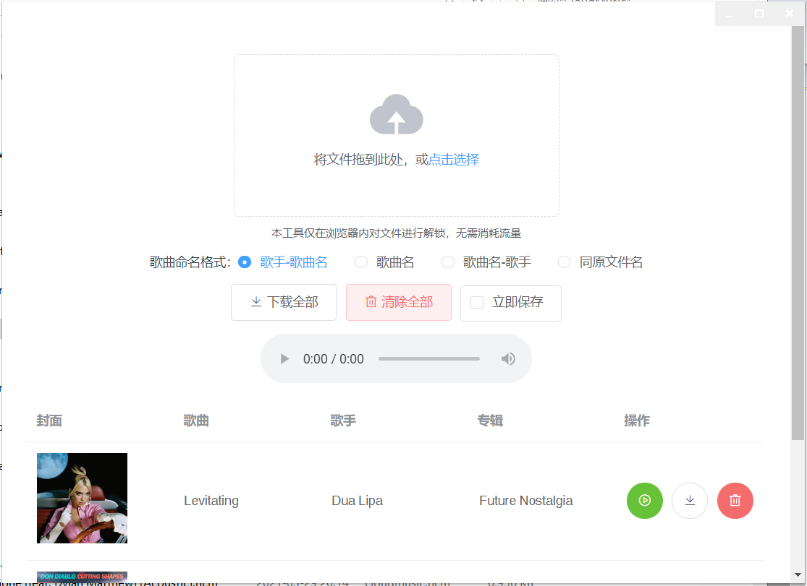

# UnlockMusic
使用aardio打包的UnlockMusic程序

`UnlockMusic`是使用js编写的音乐格式转换软件，去掉国产音乐平台加的私有包皮。

本项目使用`aardio`对`UnlockMusic`（1.8.1）的前端代码打包成单文件的exe，采用微软最新的webview2组件，与浏览器分离。

2项技术的完成度都很高，所以整个项目有用的代码就几行。

该项目仅为学习目的。

###### 安装依赖

进入web.src目录， npm install 安装依赖包

##### 开发环境

1. npm run serve  构建网站
2. 打开aardio进行开发，调试

##### 打包程序

1. npm run build  构建前端代码，发布目录为dist
2. 将dist目录下的文件复制到工程子目录web文件夹中
3. 使用aardio ide 发布exe

